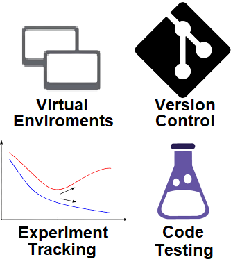
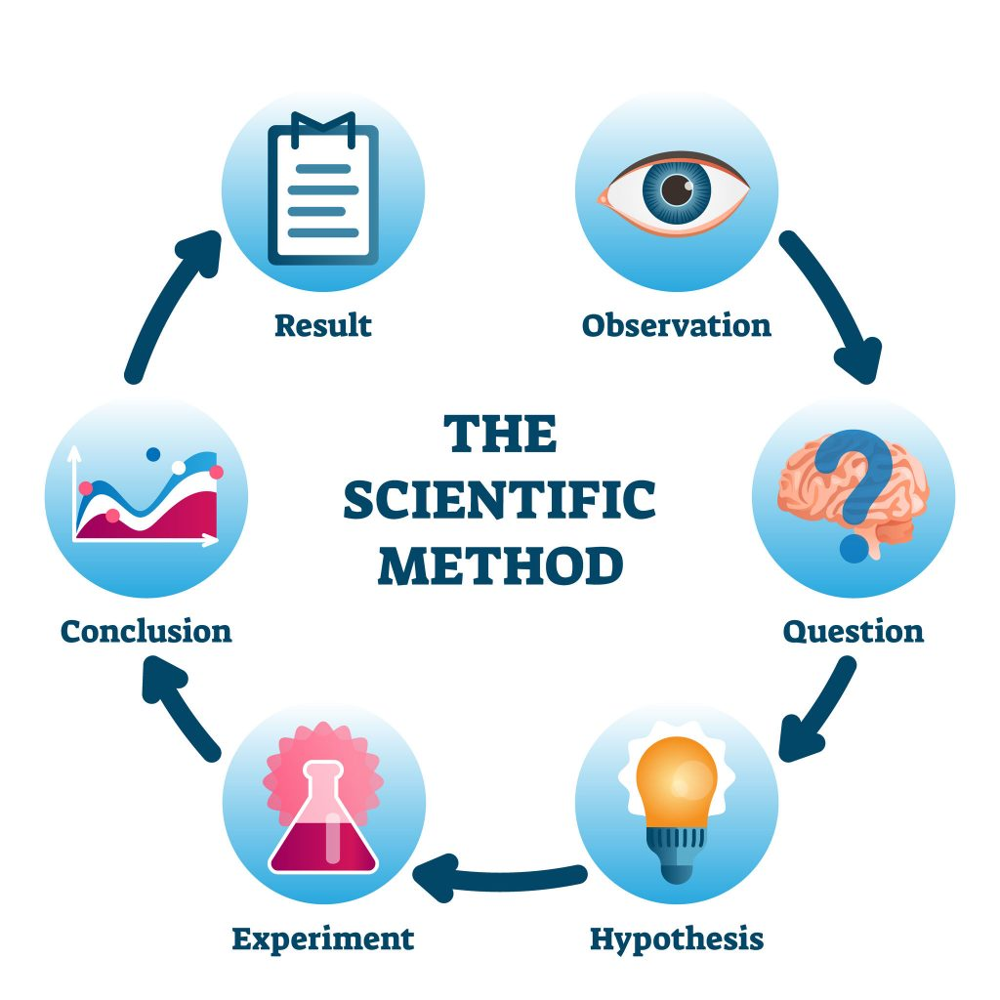

---
hide:
  - navigation
  - toc
---

<p align="center">

</p>

# MLOps for data scientists

Webpage: <https://skaftenicki.github.io/ku_devops/>
To get started, clone the repository:

```bash
git clone https://github.com/SkafteNicki/ku_devops
```

This repository contains a small introduction to *machine learning operations* (MLOps) for data scientists. The four
core topics covered are:

* [Virtual environments](https://github.com/SkafteNicki/ku_devops/tree/main/virtual_environments)
* [Version control](https://github.com/SkafteNicki/ku_devops/tree/main/version_control)
* [Experiment tracking](https://github.com/SkafteNicki/ku_devops/tree/main/experiment_tracking)
* [Code testing](https://github.com/SkafteNicki/ku_devops/tree/main/code_testing)

You are supposed to do them in the order listed. When doing the exercises, to maximize your MLOps/DevOps experience you 
should prioritize:

1. Make yourself familiar with running commands in the terminal. The terminal can be a scary place, but it is an
   essential skill to be able to run commands without relying on a graphical interface. If you want a good introduction 
   to using the shell, I highly recommend the first two lectures from [this MIT course](https://missing.csail.mit.edu/).

2. Only use scripts e.g. no notebooks for these exercises. Notebooks have their benefits but the fact is that developing
   software in the *real world* is done in scripts. Therefore make sure that whenever you are writing code for the
   exercises do this in `.py` scripts. If you feel like you miss the interactiveness of notebooks when working with the 
   script I can highly recommend giving [ipython](https://ipython.org/) a spin.

3. Get a good code editor, and try using it. If you do not have one, I can highly recommend
   [Visual Studio Code](https://code.visualstudio.com/) that are a lightweight editor, but through extensions can become 
   powerful. Otherwise, I also recommend [PyCharm](https://www.jetbrains.com/pycharm/).

Why should a data scientist care about MLOps? Because MLOps provides processes and tools for creating *reproducible*
experiments at scale when working with any kind of machine learning model. Being able to ensure that your experiments 
are reproducible is important in the context of the scientific method:

<p align="center">

<br>
<a href="https://www.australianenvironmentaleducation.com.au/education-resources/what-is-the-scientific-method/"> Image credit </a>
</p>

Without reproducibility, the method breaks at the experimental stage, as non-reproducible experiments will most likely
lead to different results and thereby different conclusions on the initial hypothesis.

For a much more complete set of material on this topic, see [this course](https://skaftenicki.github.io/dtu_mlops/)
which goes over the nearly complete pipeline of designing, modeling and deploying machine learning applications.
