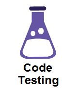
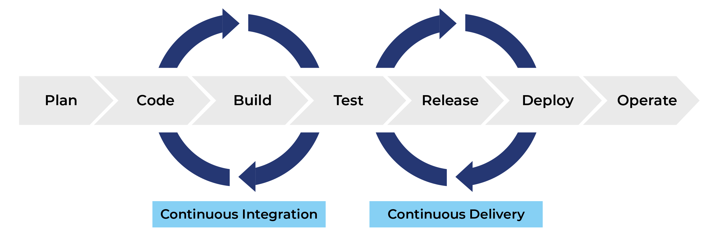

# Code testing

<p align="center">
  
</p>

Code testing is an essential part of what we call *continuous integration (CI)* within DevOps/MLOps. Continuous X
assumes that we have a (long) developer pipeline (see image below) where we want to make some changes to our code e.g:

* Update our training data or data processing
* Update our model architecture
* Something else...

Basically any code change we will expect will have a influence on the final result. The problem with
doing changes to the start of our pipeline is that we want the change to propagate all the way through
to the end of the pipeline.

<p align="center">
  
  <br>
  <a href="https://faun.pub/most-popular-ci-cd-pipelines-and-tools-ccfdce429867"> Image credit </a>
</p>

This is where continues integration comes into play. The word *continuous* here refer to the fact that the pipeline
should *continuously* be updated as we make code changes. You can also choose to think of this as *automatization* of
processes. As indicated in the image above, CI usually takes care of the first part of the developer pipeline that has
to do with the code base, code building and code testing.

In the middle of the figure, we have the word *test*, which refers to testing of our code. Testing are checks that we
implement that we can run after we have made changes to our code to make sure that it is still doing what we think it
should do, and that the changes we have made have not introduces bugs.

The kind of tests we are going to look at are called [unit testing](https://en.wikipedia.org/wiki/Unit_testing). Unit
testing refer to the practice of writing test that tests individual parts of your code base to test for correctness. By
unit you can therefore think a function, module or in general any object. By writing tests in this way it should be
very easy to isolate which part of the code that broke after an update to the code base. Another way to test your code
base would be through [integration testing](https://en.wikipedia.org/wiki/Integration_testing) which is equally
important but we are not going to focus on it in this course.

## Exercises

1. Read the [getting started guide](https://docs.pytest.org/en/6.2.x/getting-started.html) for pytest which is the
   testing framework that we are going to use. We have started a file for you called `test_numpy.py` which you can
   implement the remaning of the exercises in.

2. Install pytest:

   ```bash
   pip install pytest
   ```

4. Write some tests. We are going to check the properties of some `numpy` functions for the sake of this exercise,
   however normally you would write test for your own code and not third-party packages. Below are some guidelines on
   some tests that should be implemented, but you are of course free to implement more tests. You can at any point check
   if your tests are passing by typing in a terminal

   ```bash
   pytest tests/
   ```

   When you implement a test you need to follow two standards, for `pytest` to be able to find your tests. First any
   files created (except `__init__.py`) should always start with `test_*.py`. Secondly, any test implemented needs to be
   wrapped into its own function that again needs to start with `test_`:

   ```python
   # this will be found and executed by pytest
   def test_something():
      ...

   # this will not be found and executed by pytest
   def something_to_test():
      ...
   ```

   1. Start by testing `np.sin`. Add a `test_np_sin` function to the `test_numpy.py` where you check that the function
      correctly works for three different values.

   2. Afterwards lets test `np.linalg.eig` which calculates the eigen decomposition for a given matrix. You should test
      the following:

      * For a given `(N,N)` matrix, that the shapes of the eigen vector matrix and eigen value matrix is also `(N,N)`
      * That for a randomly generated symmetric matrix, that all the eigenvalues are all real
      * That for a positive semidefinite matrix, that all the eigvenvalues are real and non-negative

   3.


   5. Good code raises errors and give out warnings in appropriate places. This is often in the case of some invalid
      combination of input to your script. Lets take a look at `np.arange` which one could argue should be better at
      raising errors. Try to think about what the following line should return and afterwards try to execute it:

      ```python
      np.arange(start=0, stop=5, step=0.5, dtype=np.int32)
      ```

      I would argue that the output does not make sense, because the input does not make sense. Lets fix that:

      ```python
      def new_arange(start, stop, step, dtype):
          if isinstance(step, float) and dtype == np.int32:
              raise ValueError('`step` argument cannot be float at the same time as argument `dtype` being int')
          return np.arange(start=start, stop=stop, step=step, dtype=dtype)
      ```

      Try implementing a test that actually checks that the error is correctly raised if the input is wrong. It should
      look a bit like this

      ```python
      def test_valueerror_being_raised():
         with pytest.raises(ValueError, match='this is the message printed')
            new_arange(start=0, stop=5, step=0.5, dtype=np.int32)
      ```

   6. A test is only as good as the error message it gives, and by default `assert` will only report that the check
      failed. However, we can help our self and others by adding strings after `assert` like

      ```python
      assert len(train_dataset) == N_train, "Dataset did not have the correct number of samples"
      ```

      Add such comments to the assert statements you just did in privious exercises.

5. After writing the different tests, make sure that they are passing locally.

6. We often want to check a function/module for various input arguments. In this case you could
   write the same test over and over again for the different input, but `pytest` also have build
   in support for this with the use of the
   [pytest.mark.parametrize decorator](https://docs.pytest.org/en/6.2.x/parametrize.html).
   Implement a parametrize test and make sure that it runs for different input.

That covers the basic of writing unittests for python code. We want to note that `pytest` of course is not the only
framework for doing this. Python actually have an build in framework called
[unittest](https://docs.python.org/3/library/unittest.html) for doing this also (but `pytest` offers a bit more
features). Another open-source framework that you could choose to checkout is
[hypothesis](https://github.com/HypothesisWorks/hypothesis) that can really help catch errors in corner cases of your
code. In addition to writing unittests it is also highly recommended to test code that you include in your
docstring belonging to your functions and modulus to make sure that any code there is in your documentation is also
correct. For such testing we can highly recommend using pythons build-in framework
[doctest](https://docs.python.org/3/library/doctest.html).
