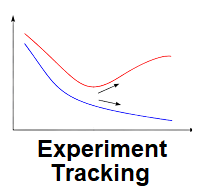
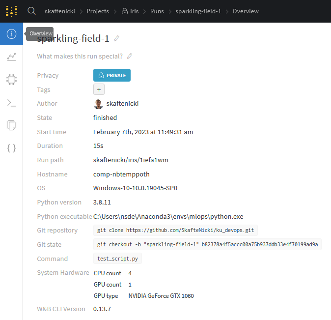
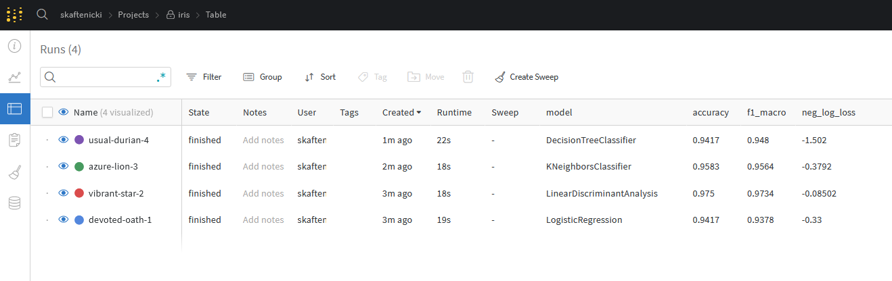

---
hide:
  - navigation
  - toc
---

{ align=right width="200"}

# Experiment tracking

Experiment logging or model monitoring is an important part of understanding what is going on with your model. It can
help you debug your model and tweak your models to perfection.

The most basic logging we can do is write the metric that our model is producing to the terminal or a file for later
inspection. We can then also use tools such as [matplotlib](https://matplotlib.org/) for plotting our data, model fit,
etc. This kind of workflow may be enough when doing smaller experiments or working alone on a project, but there is no
way around using a proper experiment tracker and visualizer when doing large-scale experiments in collaboration with
others. It especially becomes important when you want to compare performance between different runs.

There exist many tools for logging your experiments, with some of them being:

* [Tensorboard](https://www.tensorflow.org/tensorboard)
* [Comet](https://www.comet.ml/site/)
* [MLFlow](https://mlflow.org/)
* [Neptune](https://neptune.ai/)
* [Weights and Bias](https://wandb.ai/site)

All of the frameworks offer many of the same functionalities. We are going to use Weights and Bias (wandb), as it 
supports everything we need in this course. Additionally, it is an excellent tool for collaboration and sharing of
results.

## Exercises

1. Start by creating an account at [wandb](https://wandb.ai/site). I recommend using your Github account but feel
    free to choose what you want. When you are logged in you should get an API key of length 40. Copy this for later
    use (HINT: if you forgot to copy the API key, you can find it under settings).

2. Next, install wandb on your laptop

    ```bash
    pip install wandb
    ```

3. Now connect to your wandb account

    ```bash
    wandb login
    ```

    you will be asked to provide the 40-length API key. The connection should remain open to the wandb server
    even when you close the terminal, such that you do not have to log in each time. If using `wandb` in a notebook
    you need to manually close the connection using `wandb.finish()`.

4. With the setup done, we are now ready to incorporate `wandb` into our code. The interface is fairly simple, and
    the [docs](https://docs.wandb.ai) are fairly well written to get you through the exercises (HINT: the two methods
    you need to call are `wandb.init` and `wandb.log`).

    1. We have provided a sample script called `wandb_script.py` that again implements a small classification model
        on the iris-dataset. Add `wandb.init` and `wandb.log` in the appropriate places such that wandb is initialized
        correctly and such that both *accuracy, f1, negative log likelihood* get logged.

    2. When you are done, try running the script:

        ```bash
        python wandb_script.py
        ```

        In particular look at the output that gets written.

    3. Next, go to the webpage and lookup the project you created and logged something to. You should hopefully see one
        experiment logged, which is not that interesting at the moment. However, we can checkout one important feature 
        if you go to the *Overview* tab for a specific experiment, like the image below:

        <p align="center">
        
        </p>

        As you hopefully can see, we get the exact Python version, git commit, command used etc. to run the experiment,
        which should make it completely reproducible!

5. The `wandb_script.py` already supports using different models by passing them in as an argument when running the 
    script

    ```bash
    python wandb_script.py --model LogisticRegression
    ```

    try running the script with all the different models. However, before doing so it is a good idea to also log the
    model we are using to wandb. Fill out the `config` arg in `wandb.init` with the model hyperparameter and run all
    combinations.

6. If you managed to do the last part, you should hopefully have logged multiple experiments now. Look at your project
    page again in your web browser. You should see all your experiments. In particular check out the `Table` tab (as in
    the image below) which can give a nice condensed overview of your experiments.

    <p align="center">
    
    </p>

7. Wandb can log a lot more than just scalar values. This could be an image (numpy array), a histogram or a matplotlib
    figure. In all cases, the logging is still going to use `wandb.log` but you need extra calls to `wandb.Image` etc.
    depending on what you choose to log. Add the following code to the `wandb_script.py` at the end and afterward figure 
    out how to call `wandb.log` to log the figure:

    ```python
    import seaborn as sns
    # Plot also the training points
    fig = sns.scatterplot(
        x=X[:, 0],
        y=X[:, 1],
        hue=df.target_names[y],
        alpha=1.0,
        edgecolor="black",
    )
    ```

8. Wandb has a nice integration with *scikit-learn* which can be very useful, so let's integrate that into our script
    for help look at this [guide](https://docs.wandb.ai/guides/integrations/scikit) and this
    [notebook](https://colab.research.google.com/github/wandb/examples/blob/master/colabs/scikit/Simple_Scikit_Integration.ipynb#scrollTo=ojLgOTVLEIxc)
    . Add the following code at the end of the script:

    ```python
    model = models[args.model]
    model.fit(X_train, y_train)
    y_pred = model.predict(X_test)
    y_probas = model.predict_proba(X_test)
    ```

    and then try to include the following lines of code:

    ```python
    wandb.sklearn.plot_class_proportions(y_train, y_test, labels)
    wandb.sklearn.plot_learning_curve(model, X_train, y_train)
    wandb.sklearn.plot_roc(y_test, y_probas, labels)
    wandb.sklearn.plot_precision_recall(y_test, y_probas, labels)
    wandb.sklearn.plot_confusion_matrix(y_test, y_pred, labels)
    ```

    and run the script again (using whatever model you like). You may not understand what each command plots,
    but hopefully, this will be more clear later on. The important part is that you can see how a lot of information can
    be logged about a single experiment.

9. When calling `wandb.init` you have two arguments called `project` and `entity`. Make sure that you understand these
    and try them out. It will come in handy for your group work as they essentially allow multiple users to upload their
    own runs to the same project in `wandb`.

10. Another awesome feature of wandb is doing hyperparameter sweeps e.g. finding the best parameters for a
    given model. You can do this in scikit-learn, however, the core advantage of using wandb is that the hyperparameter
    optimization gets abstracted away, meaning that if you want to do hyperparameter sweeping for a framework other than
    scikit-learn it would still be the same code. We provide a sample script `wandb_sweep.py` that does hyperparameter
    optimization for you. Try to go over it and try to make sense of what is going on. Afterward, execute it

    ```bash
    python wandb_sweep.py
    ```

    It will take some time to run (by default it runs 10 combinations of parameters). Afterwards, checkout the sweep
    tab on the website, where you should figure out:

    * What combination of parameters leads to the highest accuracy value?
    * What parameter has the highest importance for getting a high accuracy value?
