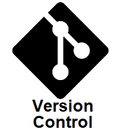
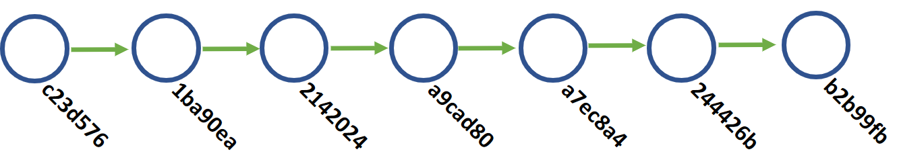
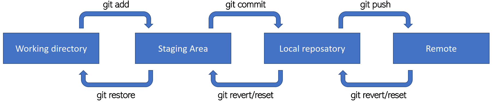
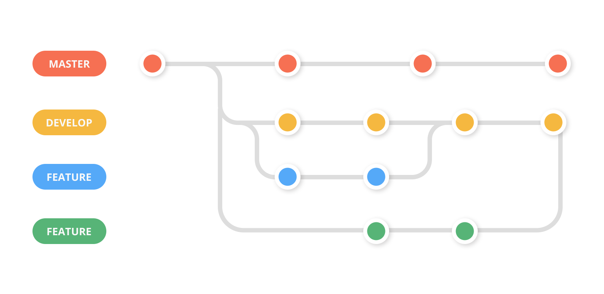
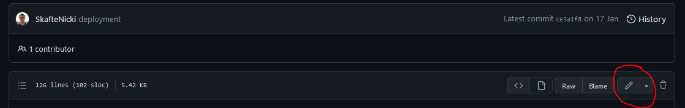

---
hide:
  - navigation
  - toc
---

{ align=right width="200"}

# Version control

Proper collaboration with other people will require that you can work on the same codebase in an organized manner.
This is the reason that **version control** exist. Simply stated, it is a way to keep track of:

* Who made changes to the code
* When did the change happen
* What changes were made

For a full explanation please see this [page](https://git-scm.com/book/en/v2/Getting-Started-What-is-Git%3F)

Secondly, it is important to note that Github is not git! Github is the dominating player when it comes to
hosting repositories but that does not mean that they are the only one providing free repository hosting
(see [bitbucket](https://bitbucket.org/product/) or [gitlab](https://about.gitlab.com/)) for some other examples).

That said we will be using git and Github in these exercises.
<p align="center">
  
  <br>
  <a href="https://xkcd.com/1597/"> Image credit </a>
</p>

## Initial config

1. [Install git](https://git-scm.com/book/en/v2/Getting-Started-Installing-Git) on your computer and make sure
   that your installation is working by writing `git help` in a terminal and it should show you the help message
   for git.

2. Create a [github](https://github.com/) account if you do not already have one.

3. To make sure that we do not have to type in our github username every time that we want to do some changes,
   we can once and for all set them on our local machine

   ```bash
   # type in a terminal
   git config credential.helper store
   git config --global user.email <email>
   ```

## Git overview

The most simple way to think of version control, is that it is just nodes with lines connecting them

<p align="center">
  
</p>

Each node, which we call a *commit* is uniquely identified by a hash string. Each node, stores what our code looked
like at that point in time (when we made the commit) and using the hash codes we can easily revert to a specific point
in time.

The commits are made up of local changes that we make to our code. A basic workflow for adding commits are seen below

<p align="center">
  
</p>

Assuming that we have made some changes to our local *working directory* and that we want to get these updates to
be online in the *remote repository* we have to do the following steps:

* First we run the command `git add`. This will move our changes to the *staging area*. While changes are in the
   staging area we can very easily revert them (using `git restore`). There have therefore not been assigned a unique
   hash to the code yet, and we can therefore still overwrite it.

* To take our code from the *staging area* and make it into a commit, we simply run `git commit` which will locally
   add a note to the graph. It is important again, that we have not pushed the commit to the online *repository* yet.

* Finally, we want others to be able to use the changes that we made. We do a simple `git push` and our
   commit gets online

Of course, the real power of version control is the ability to make branches, as in the image below

<p align="center">

<br>
<a href="https://dev.to/juanbelieni/creating-an-alias-for-deleting-useless-git-branches-105j"> Image credit </a>
</p>

Each branch can contain code that are not present on other branches. This is useful when you are many developers
working together on the same project.

## Exercises

1. In your github account create an repository, where the intention is to upload and version control a script

    1. After creating the repository, clone it to your computer

        ```bash
        git clone https://github.com/my_user_name/my_repository_name.git
        ```

   2. Create/Copy/Move the `simple_classifier.py` file and the `requirements.txt` file from the last virtual environment
        exercises into this repository.

   3. Add the files to a commit by using `git add` command

   4. Commit the files using `git commit`

   5. Finally push the files to your repository using `git push`. Make sure to check online that the files have been
        updated in your repository.

   6. You can always use the command `git status` to check where you are in the process of making a commit.

2. Make sure that you understand how to make branches, as this will allow you to try out code changes without
    messing with your working code. Creating a new branch can be done using:

    ```bash
    # create a new branch
    git checkout -b <my_branch_name>
    ```

    Afterwards, you can use `git checkout` to change between branches (remember to commit your work!)
    Try adding something (a file, a new line of code etc.) to the newly created branch, commit it and
    try changing back to master afterwards. You should hopefully see whatever you added on the branch
    is not present on the main branch.

3. Try to make a couple of commits to either your newly created branch or your main branch, lets say at least two.
    Afterwards try executing

    ```bash
    git log
    ```

    which will give you info about the last couple of commits. Try to figure out how you can rollback to a previous
    commit? Hint: you need to use the `git checkout` command + the commit hash you get from `git log`.

3. As a final exercise we want to simulate a *merge conflict*, which happens when two users try to commit changes
    to exactly same lines of code in the codebase, and git is not able to resolve how the different commits should be
    integrated.

    1. In your browser, open your repository, go to any file of your choosing and click the edit button (see image below)
        and make some change to the file. For example, if you choose a python file you can just import some random
        packages at the top of the file. Commit the change.
        <p align="center">
        
        </p>

    2. Make sure not to pull the change you just made to your local computer. Locally make changes to the same
        file in the same lines and commit them afterwards.

   3. Now try to `git pull` the online changes. What should (hopefully) happen is that git will tell you that it found
        a merge conflict that needs to be resolved. Open the file and you should see something like this

        ```txt
        <<<<<<< HEAD
        this is some content to mess with
        content to append
        =======
        totally different content to merge later
        >>>>>>> master
        ```

        this should be interpret as: everything thats between `<<<<<<<` and `=======` are the changes made by your local
        commit and everything between `=======` and `>>>>>>>` are the changes you are trying to pull. To fix the merge
        conflict you simply have to make the code in the two "cells" work together. When you are done, remove the
        identifiers `<<<<<<<`, `=======` and `>>>>>>>`.

    4. Finally, commit the merge and try to push.